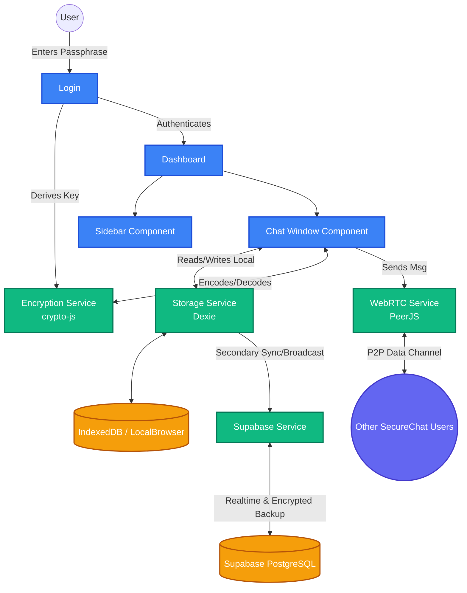

# SecureChat 🔒

SecureChat is a privacy-first, decentralized, real-time messaging application. It ensures absolute privacy by employing end-to-end encryption, peer-to-peer (P2P) communication, and local-first data storage.

## 🚀 Features

- **True End-to-End Encryption:** All messages and files are encrypted locally in your browser using standard AES encryption before they are ever transmitted. Keys are generated via SHA256 hashing from your secret passphrase.
- **Peer-to-Peer Messaging:** Direct communication between users using WebRTC (PeerJS). Messages go strictly from point A to point B without a middleman server whenever possible.
- **Local-First Storage:** Chat history is stored entirely in your browser using IndexedDB (Dexie).
- **Cloud Fallback & Sync:** Real-time broadcasting and encrypted backup using Supabase for when P2P connections are unstable or when joining group rooms.
- **Rich Messaging Options:**
  - File Sharing (Encrypted up to 5MB)
  - Message Reactions & Editing
  - Pinning and Bookmarking Messages
  - Real-time Typing Indicators & Read-receipts 
- **Theming:** Includes multiple UI themes like Dark Theme, Hacker Green, Purple Neon, and Minimal White.

---

## 🛠️ Tech Stack

- **Frontend Framework:** React 18, Vite
- **Styling:** CSS Modules / Vanilla CSS (`globals.css`), Framer Motion (Animations), Lucide React (Icons)
- **Encryption:** `crypto-js` (AES-256 for messages/files, SHA-256 for key derivation)
- **WebRTC / Networking:** `peerjs` (P2P connections)
- **Local Storage:** `dexie` (IndexedDB Wrapper)
- **Backend / Realtime Sync:** `@supabase/supabase-js` (PostgreSQL Database, Realtime Channels)

---

## 🏗️ System Architecture

The following diagram illustrates how the components of SecureChat interact securely:

### Component Flow breakdown:
1. **Authentication (Pseudo):** Upon login, `encryptionService.js` hashes the user's passphrase to generate an AES key and loads the `Dashboard`.
2. **Connectivity:** `webrtcService.js` establishes a PeerJS connection for direct communication. `supabaseService.js` subscribes to real-time channels targeting the specific user.
3. **Messaging:** When sending a message via `ChatWindow`, it is encrypted by `CryptoService` before transmission.
4. **Transmission:** 
   - `WebRTCService` attempts to send it directly to the receiver's Peer ID.
   - Concurrently, `StorageService` saves the message locally to `IndexedDB`.
   - If the user is the sender, `StorageService` broadcasts the payload to `Supabase` to guarantee delivery to offline peers and populate group rooms.
5. **Retrieval & Rendering:** The UI continuously observes the local database using `dexie` subscriptions. When a new encrypted payload arrives (via P2P or Supabase), it gets stored, decrpyted in-memory, and immediately rendered.

---

## 💻 Local Setup Instructions

Follow these steps to run SecureChat on your local machine:

### Prerequisites

- Node.js (v16 or higher)
- npm or yarn
- A Supabase Project (for backend fallback / realtime)

### 1. Clone the repository
\`\`\`bash
git clone <your-repository-url>
cd SecureChat
\`\`\`

### 2. Install Dependencies
\`\`\`bash
npm install
\`\`\`

### 3. Setup Environment Variables
Create a `.env` file in the root directory and add your Supabase credentials:
\`\`\`env
VITE_SUPABASE_URL=your_supabase_project_url
VITE_SUPABASE_ANON_KEY=your_supabase_anon_key
\`\`\`
*(Note: SecureChat will still run using pure P2P if you leave these blank or omit the file, but backend sync will naturally be disabled.)*

### 4. Run the Development Server
\`\`\`bash
npm run dev
\`\`\`

Open [http://localhost:5173](http://localhost:5173) in your browser. 
*(Pro-tip: Open two incognito windows with different usernames to test P2P communication!)*

### 5. Build for Production
To build the static files for production deployment (e.g., Vercel, Netlify):
\`\`\`bash
npm run build
\`\`\`
The bundled files will be located in the `dist` directory.
